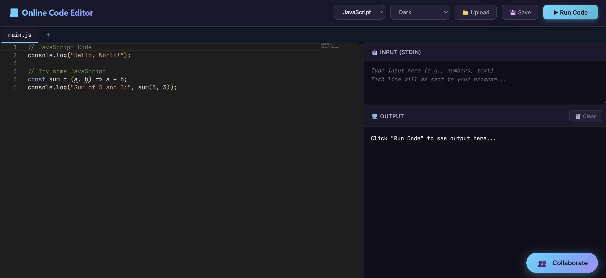
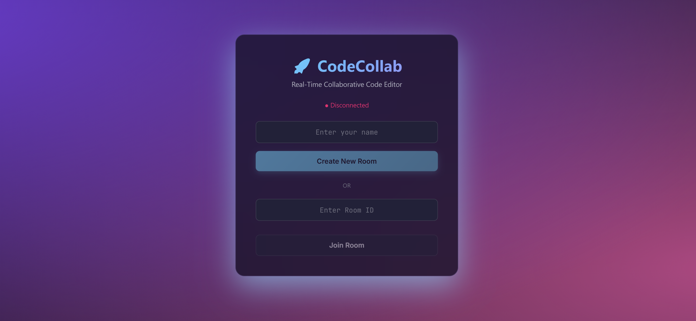
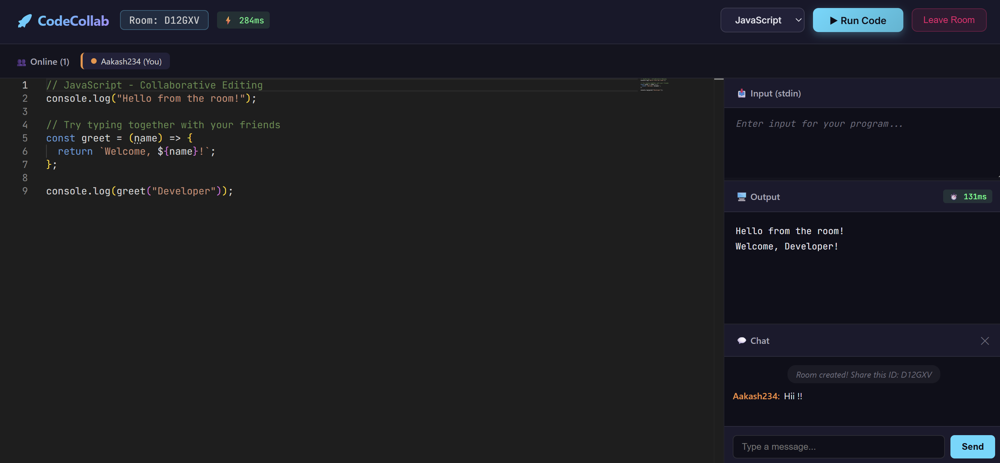
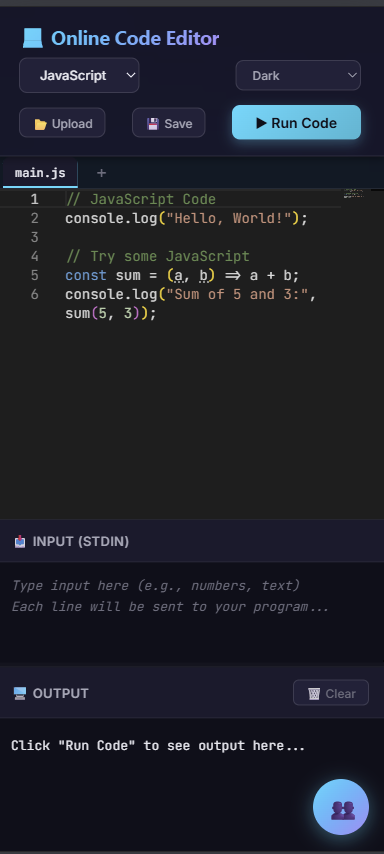

# 🚀 CodeCollab - Real-Time Collaborative Code Editor

A cloud-based, real-time collaborative code editor that enables multiple users to write, execute, and debug code simultaneously across 5+ programming languages. Built with modern web technologies and focusing on computer networking concepts.

[](https://online-code-editor-green.vercel.app)
[](https://github.com/aakashsen704/online-code-editor)
[](LICENSE)

---

## ✨ Features

### 🎯 Core Features
- **Multi-Language Support** - JavaScript, Python, Java, C++, C
- **Real-Time Code Execution** - Run code directly in the browser
- **Standard Input (stdin)** - Support for interactive programs
- **Syntax Highlighting** - Monaco Editor (VS Code engine)
- **Error Detection** - Real-time syntax validation for JavaScript
- **Multiple Themes** - Dark, Light, High Contrast
- **File Management** - Upload, download, multiple tabs
- **Mobile Responsive** - Works on desktop, tablet, and mobile

### 👥 Collaboration Features (NEW!)
- **Real-Time Synchronization** - See code changes instantly (<100ms latency)
- **Room System** - Create or join rooms with unique 6-character IDs
- **User Presence** - See who's online with colored indicators
- **Remote Cursors** - Track where others are typing
- **Group Chat** - Built-in messaging system
- **Network Metrics** - Real-time latency monitoring (ping/pong)
- **WebSocket Protocol** - Persistent bidirectional communication

---

## 🛠️ Tech Stack

### Frontend
- **Framework:** React 18
- **Editor:** Monaco Editor (VS Code)
- **Styling:** Custom CSS (Modern dark theme)
- **HTTP Client:** Axios
- **WebSocket:** Socket.io Client
- **Build Tool:** Vite
- **Hosting:** Vercel (CDN + Auto-deploy)

### Backend
- **Runtime:** Node.js 18+
- **Framework:** Express.js
- **WebSocket:** Socket.io Server
- **Code Execution:** Child Process API
- **Languages:** Python 3, GCC, G++, Java, Node.js
- **Hosting:** Render (Free tier)

### DevOps
- **Version Control:** Git + GitHub
- **CI/CD:** Automatic deployment via Vercel + Render
- **Environment:** Ubuntu 24 (Render), Node.js
- **Cost:** $0/month (free tier)

---

## 🎓 Computer Networking Concepts

This project demonstrates key networking concepts:

| Concept | Implementation |
|---------|---------------|
| **WebSocket Protocol** | Persistent bidirectional connection (`io.on('connection')`) |
| **Client-Server Architecture** | Frontend ↔ Backend communication |
| **Event-Driven Communication** | `socket.emit()` / `socket.on()` |
| **Broadcasting** | One-to-many message distribution (`socket.to(room).emit()`) |
| **Rooms/Namespaces** | Group users together (`socket.join(roomId)`) |
| **Network Latency** | Round-trip time measurement (ping/pong) |
| **Real-Time Sync** | Delta updates for efficiency |
| **HTTP/HTTPS** | RESTful API for code execution |
| **CORS** | Cross-Origin Resource Sharing |

---

## 🚀 Quick Start

### Prerequisites
- Node.js 18+ installed
- npm or yarn
- Git

### 1. Clone the Repository

```bash
git clone https://github.com/aakashsen704/online-code-editor.git
cd online-code-editor
```

### 2. Setup Backend

```bash
cd backend

# Install dependencies
npm install

# Create .env file (optional)
echo PORT=5000 > .env

# Start development server
npm run dev
```

Backend will run at `http://localhost:5000`

### 3. Setup Frontend

```bash
cd ../frontend

# Install dependencies
npm install

# Create .env.development file
echo VITE_API_URL=http://localhost:5000 > .env.development

# Start development server
npm run dev
```

Frontend will run at `http://localhost:3000`

### 4. Test Locally

**Solo Mode:**
1. Open `http://localhost:3000`
2. Write code and click "Run Code"

**Collaborative Mode:**
1. Click "👥 Collaborate" button
2. Create a room or join with a Room ID
3. Open incognito window to test multi-user

---

## 📁 Project Structure

```
online-code-editor/
├── backend/
│   ├── server.js              # Express + Socket.io server
│   ├── package.json           # Backend dependencies
│   ├── temp/                  # Temporary code execution files
│   └── .env                   # Environment variables
│
├── frontend/
│   ├── src/
│   │   ├── App.jsx            # Main app with mode switcher
│   │   ├── SoloEditor.jsx     # Solo code editor component
│   │   ├── CollabRoom.jsx     # Collaborative room component
│   │   ├── App.css            # Solo editor styles
│   │   └── CollabRoom.css     # Collaboration styles
│   ├── package.json           # Frontend dependencies
│   ├── vite.config.js         # Vite configuration
│   ├── .env.development       # Local backend URL
│   └── .env.production        # Production backend URL
│
├── .gitignore                 # Git ignore rules
├── README.md                  # This file
└── LICENSE                    # MIT License
```

---

## 🌐 Deployment

### Backend (Render)

1. **Push to GitHub:**
   ```bash
   git add backend/
   git commit -m "Update backend"
   git push origin main
   ```

2. **Render Auto-Deploys** (linked to GitHub)
   - Wait 2-3 minutes
   - Check: https://online-code-editor-nmc0.onrender.com/api/health

3. **Environment Variables on Render:**
   - `FRONTEND_URL` = `https://online-code-editor-green.vercel.app`
   - `PORT` = `5000` (auto-set)

### Frontend (Vercel)

1. **Create `.env.production`:**
   ```bash
   cd frontend
   echo VITE_API_URL=https://online-code-editor-nmc0.onrender.com > .env.production
   ```

2. **Push to GitHub:**
   ```bash
   git add frontend/
   git commit -m "Update frontend"
   git push origin main
   ```

3. **Vercel Auto-Deploys** (linked to GitHub)
   - Wait 1-2 minutes
   - Check: https://online-code-editor-green.vercel.app

---

## 🎮 Usage

### Solo Mode

1. Visit the app
2. Select language (JavaScript, Python, Java, C++, C)
3. Write your code
4. (Optional) Add input in the stdin box
5. Click "Run Code"
6. View output and execution time

### Collaborative Mode

**Create a Room:**
1. Click "👥 Collaborate" button
2. Enter your name
3. Click "Create New Room"
4. Share the Room ID with friends

**Join a Room:**
1. Click "👥 Collaborate" button
2. Enter your name
3. Enter Room ID (6 characters)
4. Click "Join Room"

**Collaborate:**
- Type code → Everyone sees it instantly
- Move cursor → Others see your colored cursor
- Send chat messages → Team communication
- Run code → Everyone sees the output
- Check latency → Monitor network performance (⚡ XXms)

---

## 🔧 Configuration

### Backend Environment Variables

Create `backend/.env`:

```env
PORT=5000
FRONTEND_URL=http://localhost:3000
NODE_ENV=development
```

### Frontend Environment Variables

**Development** (`frontend/.env.development`):
```env
VITE_API_URL=http://localhost:5000
```

**Production** (`frontend/.env.production`):
```env
VITE_API_URL=https://online-code-editor-nmc0.onrender.com
```

---

## 📡 API Endpoints

### REST API

| Endpoint | Method | Description |
|----------|--------|-------------|
| `/api/execute` | POST | Execute code |
| `/api/languages` | GET | Get supported languages |
| `/api/health` | GET | Health check |
| `/api/rooms` | GET | List active rooms |
| `/api/rooms/:id` | GET | Get room details |

### WebSocket Events

**Client → Server:**
```javascript
socket.emit('create-room', { username, language })
socket.emit('join-room', { roomId, username })
socket.emit('code-change', { roomId, code, cursorPosition })
socket.emit('cursor-move', { roomId, position })
socket.emit('chat-message', { roomId, message })
socket.emit('ping', { timestamp })
```

**Server → Client:**
```javascript
socket.on('room-created', { roomId, code, users })
socket.on('room-joined', { roomId, code, users })
socket.on('code-update', { code, userId, cursorPosition })
socket.on('cursor-update', { userId, username, color, position })
socket.on('chat-message', { userId, username, message, timestamp })
socket.on('user-joined', { user, users })
socket.on('user-left', { userId, username, users })
socket.on('pong', { clientTimestamp, serverTimestamp })
```

---

## 🧪 Testing

### Local Testing

**Solo Mode:**
```bash
# Terminal 1: Backend
cd backend && npm run dev

# Terminal 2: Frontend
cd frontend && npm run dev

# Browser: http://localhost:3000
```

**Collaborative Mode:**
```bash
# Same as above, then:
# Window 1: Create room
# Window 2 (Incognito): Join room with Room ID
```

### Mobile Testing

```bash
# Find your IP address
ipconfig  # Windows
ifconfig  # Mac/Linux

# On phone (same WiFi):
# Open: http://YOUR_IP:3000
```

### Production Testing

```
Frontend: https://online-code-editor-green.vercel.app
Backend: https://online-code-editor-nmc0.onrender.com/api/health
```

---

## 📊 Performance

| Metric | Value |
|--------|-------|
| **Code Execution Timeout** | 5 seconds |
| **WebSocket Latency** | 50-150ms (typical) |
| **Room Persistence** | 24 hours of activity |
| **Max Users per Room** | 10 users |
| **Supported Languages** | 5 (JavaScript, Python, Java, C++, C) |
| **Deployment Regions** | Global (Vercel CDN), US-West (Render) |

---

## 🔐 Security

- **Code Isolation:** Each execution runs in isolated temporary files
- **Timeout Protection:** 5-second execution limit prevents infinite loops
- **Input Sanitization:** All WebSocket messages are validated
- **CORS Protection:** Whitelisted frontend origins only
- **Environment Variables:** Sensitive data stored securely, not in repository
- **HTTPS:** All production traffic encrypted (SSL/TLS)

---

## 🗺️ Roadmap

### Phase 1 ✅ (Completed - January 2026)
- [x] Monaco code editor integration
- [x] Multi-language support (5 languages)
- [x] Real-time code execution
- [x] File upload/download
- [x] Cloud deployment (Vercel + Render)
- [x] Mobile responsive design

### Phase 2 ✅ (Completed - February 2026)
- [x] WebSocket real-time collaboration
- [x] Room system with unique IDs
- [x] Live code synchronization (<100ms)
- [x] User presence tracking
- [x] Group chat functionality
- [x] Network latency monitoring

### Phase 3 (In Progress)
- [ ] WebRTC peer-to-peer connections
- [ ] Network performance analytics dashboard
- [ ] Multi-file project support
- [ ] File explorer with folders
- [ ] Download project as ZIP
- [ ] Code formatting (Prettier)

### Phase 4 (Future Enhancements)
- [ ] User authentication (GitHub/Google OAuth)
- [ ] Project persistence (MongoDB)
- [ ] Save and load projects
- [ ] GitHub repository integration
- [ ] Terminal emulator
- [ ] Debugging with breakpoints
- [ ] AI code suggestions
- [ ] Code review and comments
- [ ] Version history
- [ ] Team workspaces

---

## 🤝 Contributing

Contributions are welcome! Please follow these steps:

1. Fork the repository
2. Create a feature branch (`git checkout -b feature/AmazingFeature`)
3. Commit your changes (`git commit -m 'Add AmazingFeature'`)
4. Push to the branch (`git push origin feature/AmazingFeature`)
5. Open a Pull Request

---

## 📝 License

This project is licensed under the MIT License - see the [LICENSE](LICENSE) file for details.

---

## 🙏 Acknowledgments

- **Monaco Editor** - VS Code's editor component
- **Socket.io** - Real-time WebSocket library
- **Vercel** - Frontend hosting
- **Render** - Backend hosting
- **React** - UI framework
- **Express.js** - Backend framework

---

## 📧 Contact

**Aakash Sen**
- GitHub: [@aakashsen704](https://github.com/aakashsen704)
- Project: [online-code-editor](https://github.com/aakashsen704/online-code-editor)
- Live Demo: [CodeCollab](https://online-code-editor-green.vercel.app)

---

## 📸 Screenshots

### Solo Editor


### Collaborative Mode - Join Screen


### Collaborative Mode - Active Room


### Mobile View


---

## 🎓 Educational Value

This project demonstrates:

1. **Full-Stack Development** - React frontend + Node.js backend
2. **Real-Time Communication** - WebSocket protocol
3. **Cloud Deployment** - Vercel + Render
4. **System Architecture** - Client-server model
5. **Network Protocols** - HTTP, WebSocket, TCP/IP
6. **Event-Driven Design** - Pub/Sub pattern
7. **Process Management** - Child processes for code execution
8. **Security Practices** - Timeout, isolation, CORS

Perfect for learning computer networking and distributed systems!

---

## 🌟 Star This Repository!

If you found this project helpful, please give it a ⭐ on GitHub!

---

**Built with ❤️ by Aakash Sen | 2026**